# UML Diagrams - Purchase Request Management System

## 1. Class Diagram

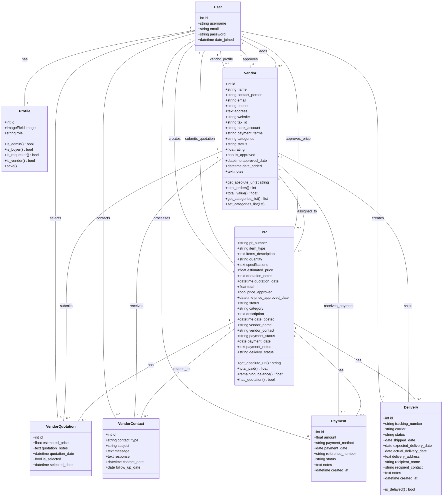

## 2. Use Case Diagram

```mermaid
graph TB
    subgraph System["Purchase Request Management System"]
        UC1[Create Purchase Request]
        UC2[View Purchase Requests]
        UC3[Update Purchase Request]
        UC4[Delete Purchase Request]
        UC5[Submit Quotation]
        UC6[Approve/Reject PR]
        UC7[Assign Vendor]
        UC8[Approve Price]
        UC9[Manage Vendors]
        UC10[Track Payments]
        UC11[Track Deliveries]
        UC12[View Dashboard]
        UC13[Search PRs]
        UC14[Manage Profile]
        UC15[Contact Vendor]
    end
    
    Requester((Requester))
    Buyer((Buyer))
    Vendor((Vendor))
    Admin((Admin))
    
    Requester --> UC1
    Requester --> UC2
    Requester --> UC3
    Requester --> UC4
    Requester --> UC12
    Requester --> UC13
    Requester --> UC14
    
    Buyer --> UC2
    Buyer --> UC6
    Buyer --> UC7
    Buyer --> UC8
    Buyer --> UC9
    Buyer --> UC10
    Buyer --> UC11
    Buyer --> UC12
    Buyer --> UC13
    Buyer --> UC14
    Buyer --> UC15
    
    Vendor --> UC2
    Vendor --> UC5
    Vendor --> UC12
    Vendor --> UC13
    Vendor --> UC14
    
    Admin --> UC2
    Admin --> UC3
    Admin --> UC4
    Admin --> UC6
    Admin --> UC7
    Admin --> UC8
    Admin --> UC9
    Admin --> UC10
    Admin --> UC11
    Admin --> UC12
    Admin --> UC13
    Admin --> UC14
    Admin --> UC15
```

## 3. Sequence Diagram - Create Purchase Request

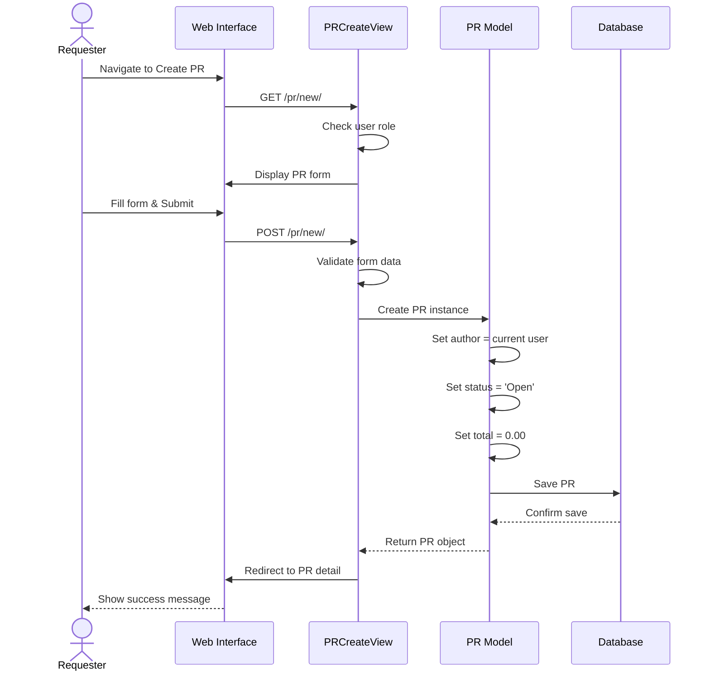

## 4. Sequence Diagram - Vendor Quotation Submission

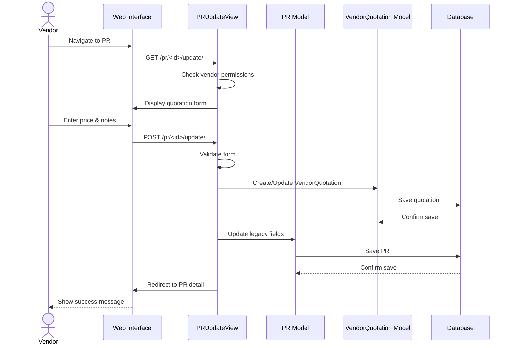

## 5. Sequence Diagram - Buyer Approval Process

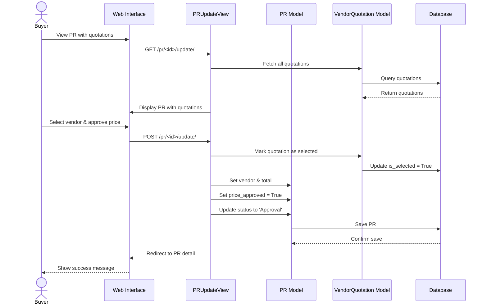

## 6. Activity Diagram - Purchase Request Workflow

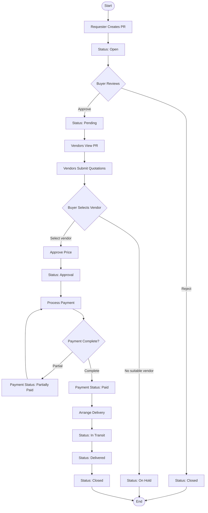

## 7. State Chart Diagram - PR Status

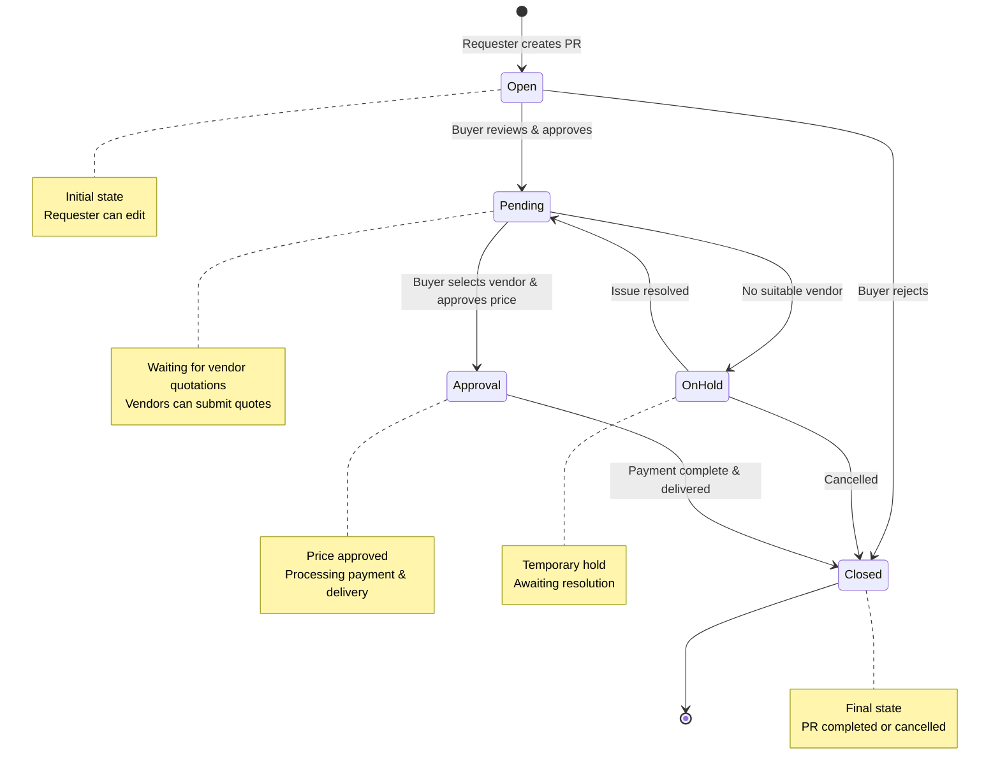

## 8. Deployment Diagram

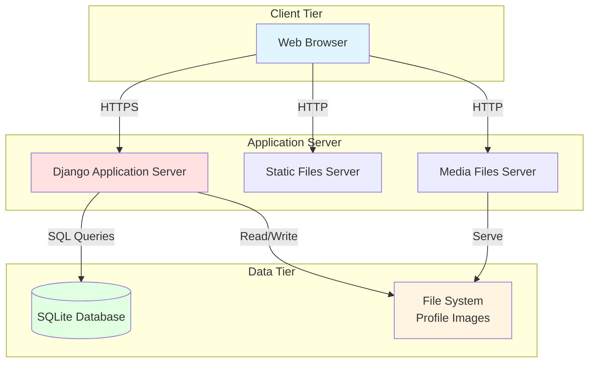

## 9. Component Diagram

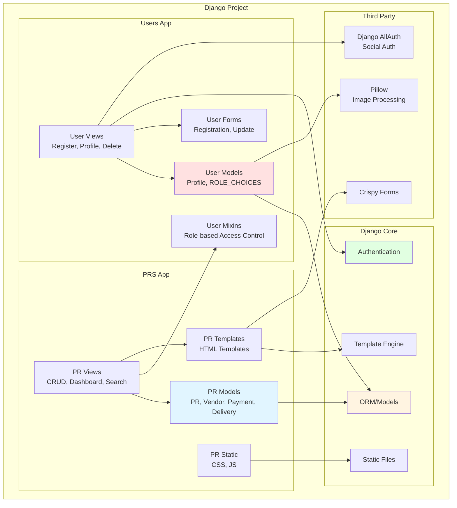

## 10. Collaboration Diagram - PR Creation

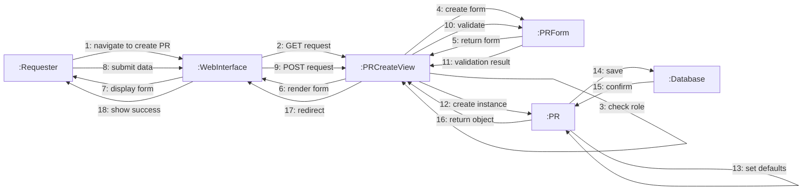

## 11. Object Diagram - PR with Quotations

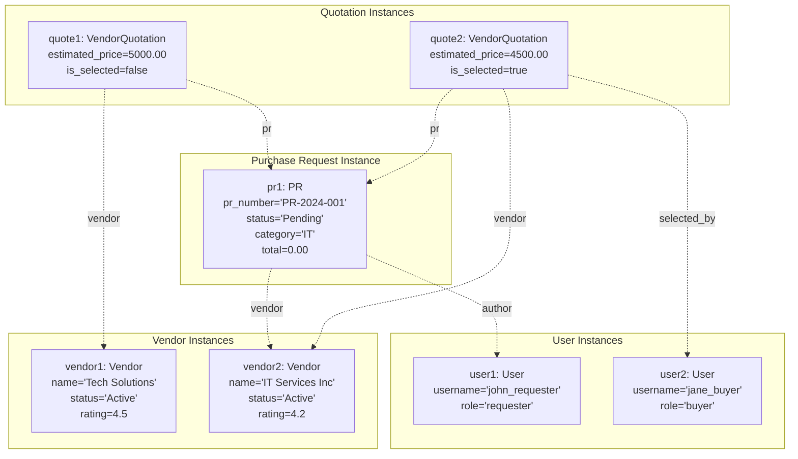

## Summary

These UML diagrams provide a comprehensive view of the Purchase Request Management System:

1. **Class Diagram**: Shows the complete data model with all entities and relationships
2. **Use Case Diagram**: Illustrates system functionality from different user perspectives
3. **Sequence Diagrams**: Detail the interaction flow for key processes
4. **Activity Diagram**: Maps the complete PR workflow from creation to completion
5. **State Chart Diagram**: Shows PR status transitions and conditions
6. **Deployment Diagram**: Illustrates the system architecture and deployment structure
7. **Component Diagram**: Shows the modular structure and dependencies
8. **Collaboration Diagram**: Details object interactions during PR creation
9. **Object Diagram**: Shows a snapshot of system objects and their relationships

These diagrams can be rendered using Mermaid-compatible tools or viewers.
ca